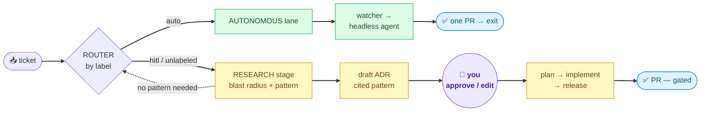

<h1 align="center">◆ &nbsp;Dyflo&nbsp; ◆</h1>

<p align="center"><em>Structure for your coding agents.</em></p>

<p align="center"><b>A repository-agnostic hybrid dev loop.</b> Point it at any repo — it routes tickets into an <b>autonomous lane</b> (headless agents, one ticket → one PR) or a <b>human-in-the-loop lane</b> (research → your approval → gated build). Runs on <b>Claude Code</b> or <b>Cursor</b>, locally or in any <b>remote environment</b>.</p>

<p align="center">
  <a href="https://github.com/Amanuel2x/dyflo/actions/workflows/ci.yml"></a>
  
  
  
  
  
</p>

<p align="center">
  <a href="#-quickstart">Quickstart</a> ·
  <a href="#-the-modes">Modes</a> ·
  <a href="#-switching-runtimes-cursor--claude-code">Switch runtime</a> ·
  <a href="#-command-reference">Commands</a> ·
  <a href="#-the-two-lanes">Lanes</a> ·
  <a href="#-configure-it-around-anything">Configure</a> ·
  <a href="docs/EXTERNAL-TOOLS.md">How it works</a>
</p>

---

## ✦ What is Dyflo?

Modern coding agents are powerful but unstructured — you point one at a task and hope. Dyflo is the **structure around the agent**: it decides *which* work goes fully autonomous vs. which needs you in the loop, gives each path the right tools, and keeps a live map of your codebase so decisions are grounded in what the change actually touches.

It composes five proven pieces (a code-graph, a lazy-coding ruleset, an unattended watcher, a human-gated flow, and your choice of models) into **one loop**, and adds the two things none of them provide on their own: a **router** (which lane?) and a **research stage** (what's the blast radius, and what pattern fits?).



**One safety invariant:** the router only ever *downgrades* (the dotted arrow — research can send a small change back to the `auto` lane). An unlabeled ticket never lands in the autonomous lane unattended; it goes through research first. Nothing ever escalates the other way.

---

## ⚡ Quickstart

**Local (personal machine):**

```bash
git clone https://github.com/Amanuel2x/dyflo.git ~/dyflo && cd ~/dyflo
./install.sh                    # Claude Code (default)
#   or:  ./install.sh --runtime cursor

cd /path/to/your/project
dyflo --bootstrap               # build the graph, hooks, vendor ponytail, write config
dyflo --assign                  # route open tickets into lanes
```

**Remote (container / cloud VM / CI) — one command from a bare box:**

```bash
curl -fsSL https://raw.githubusercontent.com/Amanuel2x/dyflo/master/remote-bootstrap.sh | bash
```

This goes from *nothing installed* to a working `dyflo` command with **zero interactive prompts** — it fetches `uv` + `graphify`, installs Dyflo for your runtime, validates auth, and self-checks. Add `--runtime cursor` to target Cursor instead of Claude Code.

**On an SSH box (e.g. EC2) — set up once, then run the autonomous fleet under tmux:**

```bash
# 1. one-time setup on the box
export CURSOR_API_KEY=...  GITHUB_TOKEN=...          # auth (warns, never stored)
curl -fsSL https://raw.githubusercontent.com/Amanuel2x/dyflo/master/remote-bootstrap.sh \
  | bash -s -- --runtime cursor

cd /path/to/your/repo
dyflo --bootstrap                                    # graph + hooks + config (once per repo)

# 2. day-to-day — one-shot commands run and exit, no tmux needed
dyflo --assign                                       # route tickets   (read-only)
dyflo --self                                         # equipped session
dyflo --docs                                         # architecture docs

# 3. the autonomous lane is a long-running loop — keep it alive under tmux,
#    one model per window so maker ≠ checker across model families
tmux new -s dyflo
DYFLO_RUNTIME=cursor DYFLO_MODEL=claude-sonnet-4-6 python3 backend-watcher.py   # coder
# Ctrl-b c →
DYFLO_RUNTIME=cursor DYFLO_MODEL=gpt-5             python3 quin-watcher.py       # QA (Quin)
# Ctrl-b c →
DYFLO_RUNTIME=cursor DYFLO_MODEL=gemini-2.5-pro    python3 tessy-watcher.py      # tests (Tessy)
# Ctrl-b d to detach — the fleet keeps running after you log out.
# Reconnect any time:  tmux attach -t dyflo
```

> The one-shot commands (`--assign`, `--self`, `--docs`) don't need tmux — they run and exit. Only the **watcher** loop does, since it polls forever; tmux is what keeps it alive across dropped SSH sessions.

That's the whole thing. Everything below is detail.

---

## Concepts in 60 seconds

| Term | Meaning |
|---|---|
| **Runtime** | The coding-agent CLI that actually runs sessions: **Claude Code** (`claude`) or **Cursor** (`cursor-agent`). Dyflo drives either. |
| **Lane** | Where a ticket goes: **autonomous** (`auto` label, no human) or **HITL** (`hitl`/unlabeled, gated). |
| **Router** | Label → lane. Deterministic, downgrade-only. |
| **Research stage** | For HITL tickets: compute blast radius (Graphify), match an architecture pattern (vendored catalog), emit a draft ADR you approve. |
| **Watcher** | The autonomous lane's engine — polls tickets, launches a headless agent per ticket, one PR, exits, repeats. |
| **Adapter** | The ticket source (GitHub built-in; Jira/Linear/etc. are one small file each). |
| **Agent roster** | Generalist coders + two specialists: **Tessy** (writes/reviews tests) and **Quin** (QA, verifies end-to-end). |

---

## Installation

Dyflo installs in layers. Pick the depth you need.

### Prerequisites

| Tool | Needed for | Auto-installed? |
|---|---|---|
| `python3` (3.10+) | the engine | no (assumed present) |
| `git` | everything | no |
| `uv` | installs Graphify | **yes** (installer/bootstrap fetch it) |
| `graphify` | the code graph | **yes** |
| `gh` CLI **or** `GITHUB_TOKEN` | GitHub ticket adapter | no |
| `claude` **or** `cursor-agent` | launching agents | no (install per your license) |
| ponytail plugin | lazy-coding discipline | optional (a copy is **bundled** for the autonomous lane) |
| TRIP skills | the HITL lane | optional |

### Local install

```bash
./install.sh                       # Claude Code, global (~/.claude), `dyflo` on PATH
./install.sh --runtime cursor      # Cursor (.cursor/ rules + commands + mcp.json)
./install.sh --project /path/repo  # project-scoped instead of global
./install.sh --no-link             # skip the PATH symlink
```

What each install writes:

| | Claude Code | Cursor |
|---|---|---|
| Instructions | `~/.claude/skills/dyflo/` | `.cursor/rules/dyflo.mdc` (always-apply) |
| Watcher | `~/.claude/skills/dyflo-watcher/` | `.cursor/rules/dyflo-watcher.mdc` |
| Doc agent | `~/.claude/agents/doc-cartographer.md` | `.cursor/rules/doc-cartographer.mdc` |
| Commands | Claude slash commands | `.cursor/commands/dyflo-research.md`, `dyflo-docs.md` |
| Graphify MCP | `claude mcp add` | `.cursor/mcp.json` |
| Headless agent | `claude -p --dangerously-skip-permissions` | `cursor-agent -p --force --sandbox disabled` |

### Remote install (bare box → ready)

```bash
# devbox: full setup on a box you'll work on (default)
./remote-bootstrap.sh --mode devbox --runtime cursor

# ci: lean one-shot for a pipeline (no PATH symlink, no menu)
./remote-bootstrap.sh --mode ci --runtime claude --repo owner/name
```

It installs `uv` + `graphify` from scratch, clones/uses the source, installs Dyflo for the runtime, validates auth env vars (warns, never blocks), runs the self-checks, and in devbox mode bootstraps the current repo.

**Auth on a remote box** (no interactive login) — set what you use:

| Env var | For |
|---|---|
| `GITHUB_TOKEN` | ticket adapter + PRs |
| `ANTHROPIC_API_KEY` | headless `claude` |
| `CURSOR_API_KEY` | headless `cursor-agent` |

Secrets are validated for presence only — never stored or printed.

---

## 🎛 The modes

Dyflo is intentionally multi-modal. Three independent axes combine into the mode you run:

**Axis 1 — Runtime** (which agent CLI): `claude` · `cursor`
**Axis 2 — Operation** (what you're doing): `assign` · `self` · `docs` · `watcher` · `bootstrap` · `check`
**Axis 3 — Environment** (where): local · remote devbox · CI

### Operation modes

| Mode | Command | What it does | Human? |
|---|---|---|---|
| **Bootstrap** | `dyflo --bootstrap` | Per-repo setup: graph, re-index hooks, vendor ponytail, write config, create labels | one-time |
| **Assign (route)** | `dyflo --assign` | Read all open tickets, sort them into `auto`/`hitl` lanes. Read-only, launches nothing | no |
| **Assign (research)** | `dyflo --assign <id>` | Run the research stage on one HITL ticket → draft ADR or downgrade | reviews ADR |
| **Self** | `dyflo --self` | Open an equipped interactive session (graph + rules + MCP loaded) and work it yourself | you drive |
| **Docs** | `dyflo --docs [focus]` | Generate `docs/ARCHITECTURE.md` with Mermaid diagrams from the graph | no |
| **Watcher** | `python3 <name>-watcher.py` | The autonomous lane: poll `auto` tickets, one headless agent per ticket → PR → exit | no |
| **Check** | `dyflo --check` | Report the active runtime + run all engine self-checks | no |

### Environment modes

| Environment | Entry | Notes |
|---|---|---|
| **Local interactive** | `dyflo <cmd>` | Full experience; the `dyflo` command on your PATH. |
| **Remote devbox** | `remote-bootstrap.sh --mode devbox` | Persistent cloud box; leaves you a working `dyflo`. |
| **CI / pipeline** | `remote-bootstrap.sh --mode ci` + [`dyflo.yml`](.github/workflows/dyflo.yml) | Non-interactive, ephemeral, secrets-based auth. No TTY needed — the launcher detects a non-interactive shell and never blocks on a prompt. |

### Putting the axes together — examples

```bash
# Personal, Claude, route tickets:
dyflo --assign

# Work, Cursor, research one big ticket with GPT-5 doing the thinking:
DYFLO_RUNTIME=cursor DYFLO_MODEL=gpt-5 dyflo --assign 142

# Remote dev box, Cursor, full setup then document the repo:
./remote-bootstrap.sh --mode devbox --runtime cursor && dyflo --docs

# CI, Claude, hourly triage (via the bundled workflow):
#   .github/workflows/dyflo.yml  — copy, add secrets, done.

# Autonomous lane at work with a QA agent on GPT and a coder on Claude:
DYFLO_RUNTIME=cursor DYFLO_MODEL=claude-sonnet-4-6 python3 backend-watcher.py &
DYFLO_RUNTIME=cursor DYFLO_MODEL=gpt-5             python3 quin-watcher.py &
```

---

## 🔄 Switching runtimes (Cursor ⇄ Claude Code)

Dyflo's engine is plain Python/shell — it doesn't care which runtime drives it. Switching is a one-word change, at three possible levels (most specific wins):

**1. Per invocation (env var) — instant, no reinstall:**

```bash
DYFLO_RUNTIME=cursor dyflo --assign     # this run uses Cursor
DYFLO_RUNTIME=claude dyflo --assign     # this run uses Claude Code
```

**2. Per repo (config) — sticks for that project:**

```jsonc
// dyflo.config.json
{ "adapter": "github", "labels": { "auto": "auto", "hitl": "hitl" }, "runtime": "cursor" }
```

**3. Per machine (install) — writes the runtime's native config layout:**

```bash
./install.sh --runtime cursor    # installs .cursor/ rules+commands+mcp
./install.sh --runtime claude    # installs ~/.claude skills+agents
```

If you set nothing, Dyflo auto-detects: it uses whichever CLI is on your PATH (`cursor-agent` or `claude`), defaulting to `claude`.

**The point:** the **same repo** can be worked with Claude at home and Cursor at work. The graph, the pattern catalog, the ADRs, the config — all shared. Only the agent that runs the session changes.

### Runtime & model resolution

Dyflo resolves **which agent runs** from what's actually on the machine — you don't have to configure it:

- **Runtime:** explicit `DYFLO_RUNTIME` (env or config) wins; else whichever of `claude` / `cursor-agent` is installed; if **both** are installed and nothing is set, it uses `claude` and prints a one-line note telling you how to switch.
- **Another agent CLI?** (codex, grok, gemini, …) `dyflo --setup` scans your PATH, shows what it found, and lets you pick "other" — you name the CLI and its flags once, and it's stored in `dyflo.config.json` under `runtimes`. The engine stays generic; no code changes. (Dyflo can't know a third-party CLI's flags, so you supply them — a wrong flag surfaces loudly on first run.)
- **Model:** with `DYFLO_MODEL` unset, Dyflo passes **no `--model` flag** — so each CLI uses **its own configured default** (whatever model you picked in Claude Code / Cursor). Set `DYFLO_MODEL` only to force a specific one.

`dyflo --check` prints the resolved runtime and model source, so you always know what will run.

### Models & maker ≠ checker

Cursor exposes whatever your plan offers (`cursor-agent --list-models`). Set the agent's model with `DYFLO_MODEL`:

```bash
DYFLO_MODEL=gpt-5 dyflo --assign 142
DYFLO_MODEL=gemini-2.5-pro python3 tessy-watcher.py
```

This unlocks real **maker ≠ checker**: run the coding agent on one model family and the review pass on another (author with Claude, review with GPT or Gemini). Different families catch each other's blind spots far better than same-model self-review — a stronger check than the single-model default.

---

## 📟 Command reference

### `dyflo` launcher

```
dyflo --setup             welcome wizard: pick your agent CLI (scans PATH), model, and ticket
                          source; checks auth; offers to bootstrap. Runs automatically the
                          first time you open dyflo in a repo with no config.
dyflo                     persistent interactive menu (assign/research/self/docs/status/adr/check);
                          shows runtime+model+repo, returns to the menu after each action;
                          type a QUESTION at the prompt instead of a number and a small fast
                          model answers it — and can configure Dyflo for you ("switch me to
                          cursor", "always use gpt-5", "rename the auto label");
                          no-ops cleanly with no TTY
dyflo --bootstrap         one-time per-repo setup (graph, hooks, ponytail, config, labels)
dyflo --assign            route all open tickets into auto/hitl lanes; then pick one (H<n> to
                          research a HITL ticket, A<n> to preview an auto one) — reuses the same
                          routing, no re-fetch
dyflo --assign <id>       run the research stage on one HITL ticket → draft ADR or downgrade
dyflo --self              open an equipped interactive session and work it yourself
dyflo --docs [focus]      document the repo → docs/ARCHITECTURE.md with Mermaid diagrams
dyflo --status            per *-watcher.py: running? label, queue depth, last logs, your open PRs,
                          and the tail of the event log
dyflo --adr [n [approve|reject]]   list ADRs with parsed status; approve/reject flips the Status
                          line, and approve prints (or offers to run) the seeded TRIP plan step
dyflo --check             report runtime + run engine self-checks
```

Every headless run tees its output to `~/.dyflo/logs/<timestamp>-<op>.log`; watcher outcomes append to `~/.dyflo/events.jsonl` (read by `--status`).

Environment variables the launcher honors:

| Var | Effect |
|---|---|
| `DYFLO_RUNTIME` | `claude` \| `cursor` — overrides config + auto-detect |
| `DYFLO_MODEL` | model id passed to the runtime (e.g. `gpt-5`, `claude-sonnet-4-6`) |
| `DYFLO_REPO` | `owner/name` for the GitHub adapter (else auto-detected from `gh`) |
| `DYFLO_ADAPTER` | ticket source (default `github`) |
| `DYFLO_ASK_MODEL` | model for the menu's ask-line (default `claude-haiku-4-5` on claude; the CLI's own default on cursor) |
| `DYFLO_ATTENDED` | `1` → run a would-be-headless session **interactively** (no `-p` / no `--force`) so you can watch and steer it |
| `DYFLO_NOTIFY_CMD` | if set, each watcher event line is piped to it (wire up Slack/ntfy without any coupling) |
| `DYFLO_STATE_DIR` | where logs + `events.jsonl` live (default `~/.dyflo`) |

### `install.sh`

```
--runtime claude|cursor   which runtime to install for (default: auto-detect → claude)
--project DIR             project-scoped install instead of global
--no-link                 skip the PATH symlink
```

### `remote-bootstrap.sh`

```
--mode devbox|ci          full setup vs lean one-shot (default: devbox)
--runtime claude|cursor   runtime to install for
--repo owner/name         target repo (CI)
--ref BRANCH              Dyflo branch/tag to install (default: master)
--src DIR                 use a local checkout instead of cloning
--no-repo-bootstrap       don't `dyflo --bootstrap` the current repo (devbox)
```

---

## 🛣 The two lanes

### Autonomous lane (`auto`)

The **watcher** (`dyflo-watcher` skill) polls your ticket source for a label, and when there's work with no open PR of its own, launches a fresh headless session that does exactly one ticket, opens a PR, and exits — then the watcher relaunches it for the next. It self-heals: a failing-CI or `CONFLICTING` PR of its own gets fixed/rebased first.

**The roster** — an agent is a label + a mission brief + its own login:

| Agent | Role | Behavior |
|---|---|---|
| **Generalist coders** | scope-agnostic | take a ticket, fix code, open a PR (label scopes the work) |
| **Tessy** | test author | writes/strengthens tests, **test-only** PRs; never touches product code; files a bug instead of silently fixing; never weakens a test to go green |
| **Quin** | QA verifier | **exercises** the change end-to-end (runs the app / hits the route); PASS-with-evidence or a bug issue; writes no product code — a green suite is a signal, not a verdict |

Each agent runs isolated (`CLAUDE_CONFIG_DIR` / `CURSOR_CONFIG_DIR`), so different logins/models don't collide. Set up via the `dyflo-watcher` skill; run each as `python3 <name>-watcher.py`.

> **Dual-use warning:** watchers run headless with skip-permissions on whatever account each config dir is logged into. Log in and test-run **one** agent before arming the rest.

### HITL lane (`hitl` / unlabeled) — the research stage

For every HITL ticket, Dyflo:

1. **Blast radius** — `graphify affected "<symbol>"` / `path` over what the ticket touches: how far it ripples, which hotspots (`god_nodes`) are in scope, whether it sits on a boundary.
2. **Pattern match** — `dyflo/patterns/lookup.py` scores the ticket against the vendored catalog (28 patterns from GoF · Fowler PoEAA · microservices.io · Hohpe EIP), each hit cited to its canonical URL; a miss falls back to live retrieval.
3. **Security + ponytail gate** — auth/secrets/input-validation tickets stay HITL regardless of size. Otherwise: *does this even need a pattern?* A small local change emits `NO_PATTERN`, gets relabeled `auto`, and drops to the autonomous lane. No ceremony.
4. **Draft ADR** — otherwise writes `docs/adr/NNN-<slug>.md` (adr.github.io format): context → blast radius (cited `file:line`) → chosen pattern → consequences. **This ADR is both the research output and the thing you approve** — it seeds the plan step.

On approval, the human-gated build (TRIP if installed: plan → implement → release) picks it up, with gates at the plan and the diff. Nothing ships without your sign-off.

---

## 🔧 Configure it around anything

`dyflo --bootstrap` writes `dyflo.config.json` in the target repo:

```jsonc
{
  "adapter": "github",
  "labels": { "auto": "auto", "hitl": "hitl" },
  "runtime": "claude"
}
```

- **Different labels?** Rename `auto`/`hitl` to whatever your team uses — the router honors it (semantics unchanged).
- **Different runtime?** Set `"runtime": "cursor"` (or use `DYFLO_RUNTIME`).
- **Different ticket source?** Set `adapter` and drop a `dyflo/adapters/<name>.py` exposing `list_open_tickets(label)` and `set_label(id, label)` returning the envelope `{id, title, body, labels, url}`. GitHub ships built-in; Jira/Linear/flat-file are each one small file — no core changes. See `dyflo/adapters/github.py` as the template.
- **Different repo for the adapter?** `export DYFLO_REPO=owner/name`.

---

## Documentation from the graph

`dyflo --docs` runs the **doc-cartographer** agent: it reads the codebase's knowledge graph and writes `docs/ARCHITECTURE.md` with Mermaid diagrams generated from the *real* structure — a system map (subsystems), a module dependency map, and call-flow diagrams per entry point — every claim cited to `file:line`, nothing from memory. Diagrams are portable Mermaid (render in GitHub/Obsidian). Safe to re-run as the code evolves (the graph re-indexes on commit).

---

## Layout

```
dyflo.sh                launcher (symlinked to `dyflo`)
install.sh              local installer (--runtime claude|cursor)
remote-bootstrap.sh     bare box → ready (--mode devbox|ci)
mcp-server.json         graphify MCP block for manual registration
.github/workflows/      dyflo.yml — ready CI workflow
dyflo/                  the engine (runtime-agnostic Python + shell)
  router.py             label → lane (no-escalation invariant); --json for the picker
  runtime.sh            claude|cursor abstraction (rt_headless child+log / rt_exec_interactive / rt_mcp_add)
  adr.py                list/gate ADRs — parse status, approve/reject, seed the TRIP plan step
  config.py             validated read/write of dyflo.config.json (what the ask-line configures through)
  status.py             --status: watcher liveness, queue depth, logs, open PRs, events (via gh)
  events.py             ~/.dyflo/events.jsonl writer/reader + optional DYFLO_NOTIFY_CMD pipe
  adapters/             ticket-source adapters (github built-in) + selfcheck
  patterns/             catalog.json (28 patterns, 4 sources) + lookup.py matcher
  docs/                 graph_to_mermaid.py — graph.json → portable Mermaid
  vendor-ponytail.sh    put ponytail's ruleset into the target repo's AGENTS.md
  vendor/               bundled ponytail AGENTS.md (MIT) — fallback for a bare box
agents/                 doc-cartographer.md — the documentation agent
skill/                  the /dyflo skill (SKILL.md + references)
  watcher/              /dyflo-watcher — the autonomous lane (engine + generalist/Tessy/Quin briefs)
docs/adr/               where the research stage writes ADRs (template.md included)
docs/EXTERNAL-TOOLS.md  what each composed tool does, with before/after examples
```

---

## What powers each part

| Part | Tool | Role |
|---|---|---|
| Persistent memory + blast radius | [Graphify](https://github.com/Graphify-Labs/graphify) | tree-sitter code graph; `affected`/`path` = "what breaks if I change X" |
| Pattern selection | vendored catalog | GoF · Fowler PoEAA · microservices.io · Hohpe EIP index; live fallback |
| Autonomous loop | `dyflo-watcher` (ships with Dyflo) | polls the source, launches headless agents, one-ticket-one-PR; generalist + Tessy + Quin |
| Code-writing discipline | [ponytail](https://github.com/DietrichGebert/ponytail) | "lazy senior dev" ruleset, vendored into the repo for the headless lane |
| Human-gated flow | [TRIP](https://github.com/PiLastDigit/TRIP-workflow) | plan → implement → release, seeded by the ADR |
| Models | Claude Code / Cursor | your choice of runtime and model; enables maker ≠ checker |

Dyflo itself is the **router** and the **research stage** — the two pieces none of those provide — plus the glue that makes them one loop. Full explanations with before/after examples: **[`docs/EXTERNAL-TOOLS.md`](docs/EXTERNAL-TOOLS.md)**.

---

## FAQ

**Do I need all the external tools?** No. Graphify is the one real dependency (the installer fetches it). Ponytail and TRIP are optional — a ponytail copy is bundled for the autonomous lane, and without TRIP the HITL lane still produces the ADR; you just drive the build yourself.

**Does it merge my PRs?** Never. Dyflo dispatches and researches; humans merge. That's a hard non-goal.

**Can it schedule itself (cron/launchd)?** No — scheduling is out of scope by design. The autonomous *loop* is the watcher process you run; the CI workflow is the scheduled entry point if you want one.

**Will the autonomous lane run without a human?** Only for tickets you explicitly labeled `auto` (or that research downgraded). Unlabeled work never runs unattended.

**Cursor caveats?** Confirm your model IDs with `cursor-agent --list-models`; `cursor-agent -p` has been reported to occasionally hang on exit (wrap CI in a timeout).

---

## Credits

Dyflo composes several open tools — install their plugins for the full experience:
[Graphify](https://github.com/Graphify-Labs/graphify),
[ponytail](https://github.com/DietrichGebert/ponytail) (MIT — a copy of its `AGENTS.md` is bundled in `dyflo/vendor/` so the autonomous lane works on a bare box; see `dyflo/vendor/ponytail-LICENSE`), and
[TRIP](https://github.com/PiLastDigit/TRIP-workflow). See [`docs/EXTERNAL-TOOLS.md`](docs/EXTERNAL-TOOLS.md) for what each does.

## Contributing

Fork it, bend it to your workflow. Before a PR, run the test suite — CI runs the same thing on Python 3.10–3.13:

```bash
./test.sh    # compile + every module's --self-check + bash -n + shellcheck. Offline, no graphify/gh.
```

Every engine module carries its own `--self-check`, and `test.sh` **discovers** them, so a new module with a self-check is tested automatically — no CI edits. See **[CONTRIBUTING.md](CONTRIBUTING.md)** for the house style (portable bash for macOS 3.2, the no-escalation invariant, the adapter seam).

## Non-goals

Dyflo never merges PRs, never schedules cron/launchd, and never escalates a ticket into unattended execution. It dispatches; humans merge; the watcher loops.

## License

MIT — see [LICENSE](LICENSE).
